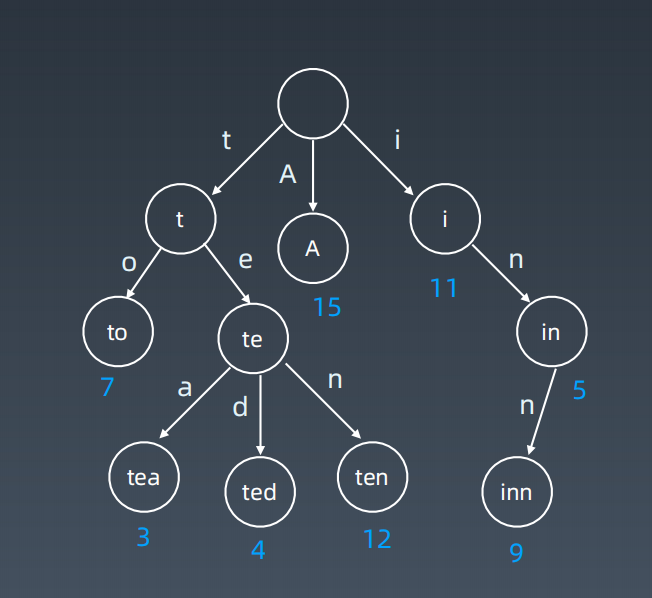

## Week07学习总结

### 字典树和并查集

### 1.字典树Trie

#### 	数据结构

​	单词查找树或键树，是一种树形结构。典型应用是用于统计和排序大量的字符串（但不仅限于

字符串），所以经常被搜索引擎系统用于文本词频统计。 

它的优点是：最大限度地减少无谓的字符串比较，查询效率比哈希表高。



#### 	核心思想

Trie 树的核心思想是空间换时间。

利用字符串的公共前缀来降低查询时间的开销以达到提高效率的目的

#### 	基本性质

1. 结点本身不存完整单词；

2. 从根结点到某一结点，路径上经过的字符连接起来，为该结点对应的

字符串；

3. 每个结点的所有子结点路径代表的字符都不相同。

#### 代码模板

```python
class Trie(object): 
def __init__(self): 
 self.root = {} 
 self.end_of_word = "#" 
def insert(self, word): 
 node = self.root 
 for char in word: 
 node = node.setdefault(char, {}) 
 node[self.end_of_word] = self.end_of_word 
def search(self, word): 
 node = self.root 
 for char in word: 
 if char not in node: 
 return False 
 node = node[char] 
 return self.end_of_word in node 
def startsWith(self, prefix): 
 node = self.root 
 for char in prefix: 
 if char not in node: 
 return False 
 node = node[char] 
 return True
```


### 2.并查集

#### 适用场景

 组团、配对问题

 Group or not ? 

#### 基本操作

makeSet(s)：建立一个新的并查集，其中包含 s 个单元素集合。

unionSet(x, y)：把元素 x 和元素 y 所在的集合合并，要求 x 和 y 所在

的集合不相交，如果相交则不合并。

fifind(x)：找到元素 x 所在的集合的代表，该操作也可以用于判断两个元

素是否位于同一个集合，只要将它们各自的代表比较一下就可以了。

```java
class UnionFind { 
private int count = 0; 
private int[] parent; 
public UnionFind(int n) { 
 count = n; 
 parent = new int[n]; 
 for (int i = 0; i < n; i++) { 
 parent[i] = i;
 } } 
public int find(int p) { 
 while (p != parent[p]) { 
 parent[p] = parent[parent[p]]; 
 p = parent[p]; 
 }
 return p; 
}
public void union(int p, int q) { 
 int rootP = find(p); 
 int rootQ = find(q); 
 if (rootP == rootQ) return; 
 parent[rootP] = rootQ; 
 count--;
} }
```

### 高级搜索

### 1.剪枝

### 2.双向BFS

### 3.启发式搜索

```python
def AstarSearch(graph, start, end): 
 pq = collections.priority_queue() # 优先级 —> 估价函数
 pq.append([start]) 
 visited.add(start) 
while pq: 
 node = pq.pop() # can we add more intelligence here ? 
 visited.add(node) 
 process(node) 
 nodes = generate_related_nodes(node) 
 unvisited = [node for node in nodes if node not in visited] 
 pq.push(unvisited)
```

#### 估价函数

启发式函数： h(n)，它用来评价哪些结点最有希望的是一个我们要找的结点，h(n) 会返回一个非负实数,也可以认为是从结点n的目标结点路径的估计成本。

启发式函数是一种告知搜索方向的方法。它提供了一种明智的方法来猜测哪个邻居结点会导向一个目标。

### 高级树，AVL树，红黑树

#### 1.AVL树

1. 发明者 G. M. Adelson-Velsky和 Evgenii Landis

2. Balance Factor（平衡因子）：

是它的左子树的高度减去它的右子树的高度（有时相反）。

balance factor = {-1, 0, 1}

3. 通过旋转操作来进行平衡（四种）

不足：结点需要存储额外信息、且调整次数频繁

#### 2.红黑树

红黑树是一种近似平衡的二叉搜索树（Binary Search Tree），它能够确保任何一个结点的左右子树的高度差小于两倍。具体来说，红黑树是满足如下条件的二叉搜索树： 

• 每个结点要么是红色，要么是黑色

• 根结点是黑色

• 每个叶结点（NIL结点，空结点）是黑色的。 

• 不能有相邻接的两个红色结点 

• 从任一结点到其每个叶子的所有路径都包含相同数目的黑色结点。