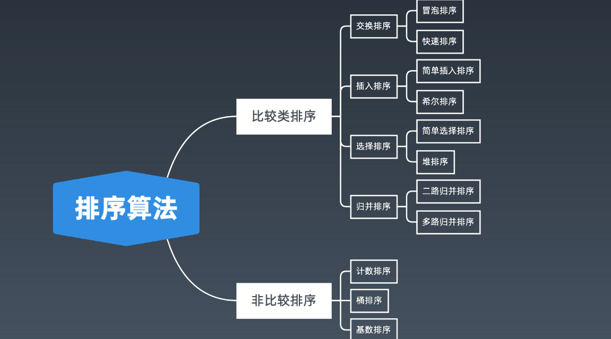
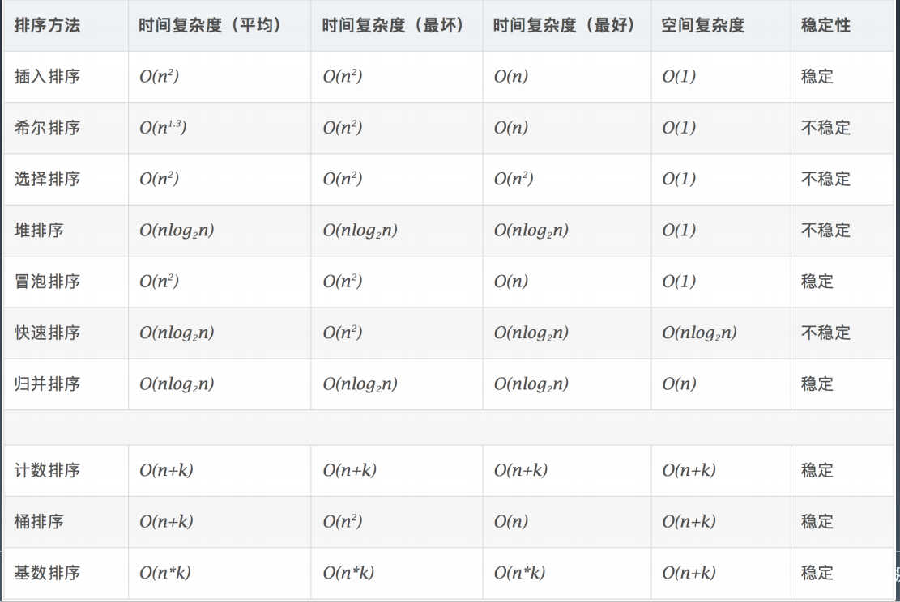

## Week08学习总结

### 一、位运算	

十进制和二进制互转

00011>>十进制 2的0次幂开始相加

50 /2 >>二进制 十进制数对2取余再取反

左移乘2

右移除2

按位或 有1为1

按位与 有0为0

按位取反 取反

按位异或 相反为1相同为0

x ^ 0 = x

x ^ 1s = ~x // **注意 1s = ~0**

x ^ (~x) = 1s

x ^ x = 0

c = a ^ b => a ^ c = b, b ^ c = a // 交换两个数

a ^ b ^ c = a ^ (b ^ c) = (a ^ b) ^ c // associative 

#### 指定位置的位运算

1. 将 x 最右边的 n 位清零：x& (~0 << n)
2. 获取 x 的第 n 位值（0 或者 1）： (x >> n) & 1
3. 获取 x 的第 n 位的幂值：x& (1 <<n)
4. 仅将第 n 位置为 1：x | (1 << n)
5. 仅将第 n 位置为 0：x & (~ (1 << n))
6. 将 x 最高位至第 n 位（含）清零：x& ((1 << n) -1)
7. 将第 n 位至第 0 位（含）清零：x& (~ ((1 << (n + 1)) -1))

#### 实战位运算要点

判断奇偶：

x % 2 == 1 —> (x & 1) == 1

x % 2 == 0 —> (x & 1) == 0

x >> 1 —> x / 2. 

即： x = x / 2; —> x = x >> 1;

mid = (left + right) / 2; —> mid = (left + right) >> 1;

X = X & (X-1) 清零最低位的 1 

X & -X => 得到最低位的 1 

X & ~X => 0

### 二、布隆过滤器、LRU缓存

一个很长的二进制向量和一系列随机映射函数。布隆过滤器可以用于检索一个元素是否在一个集合中。 

优点：是空间效率和查询时间都远远超过一般的算法

缺点：是有一定的误识别率和删除困难

```python
from bitarray import bitarray 
import mmh3 
class BloomFilter: 
def __init__(self, size, hash_num): 
self.size = size 
self.hash_num = hash_num 
self.bit_array = bitarray(size) 
self.bit_array.setall(0) 
def add(self, s): 
for seed in range(self.hash_num): 
result = mmh3.hash(s, seed) % self.size 
self.bit_array[result] = 1
def lookup(self, s): 
for seed in range(self.hash_num): 
result = mmh3.hash(s, seed) % self.size 
if self.bit_array[result] == 0: 
return "Nope"
return "Probably"
bf = BloomFilter(500000, 7) 
bf.add("dantezhao") 
print (bf.lookup("dantezhao")) 
print (bf.lookup("yyj"))
```


### 三、排序

1. **比较类排序：** 

通过比较来决定元素间的相对次序，由于其时间复杂度不能突破 O(nlogn)，因此也称为非线性时间比较类排序。 

2. **非比较类排序**： 

不通过比较来决定元素间的相对次序，它可以突破基于比较排序的时间下界，以线性时间运行，因此也称为线性时间非比较类排序。





#### 初级排序 - O(n^2)

1. 选择排序（Selection Sort） 

每次找最小值，然后放到待排序数组的起始位置。

2. 插入排序（Insertion Sort） 

从前到后逐步构建有序序列；对于未排序数据，在已排序序列中从后

向前扫描，找到相应位置并插入。

3. 冒泡排序（Bubble Sort） 

嵌套循环，每次查看相邻的元素如果逆序，则交换。

#### 高级排序 - O(N*LogN)

快速排序（Quick Sort） 

数组取标杆 pivot，将小元素放 pivot左边，大元素放右侧，然后依次

对右边和右边的子数组继续快排；以达到整个序列有序。

```java
public static void quickSort(int[] array, int begin, int end) {
 if (end <= begin) return;
 int pivot = partition(array, begin, end);
 quickSort(array, begin, pivot - 1);
 quickSort(array, pivot + 1, end);
}
static int partition(int[] a, int begin, int end) {
 // pivot: 标杆位置，counter: ⼩于pivot的元素的个数
 int pivot = end, counter = begin;
 for (int i = begin; i < end; i++) {
 if (a[i] < a[pivot]) {
 int temp = a[counter]; a[counter] = a[i]; a[i] = temp;
 counter++;
 }
 }
 int temp = a[pivot]; a[pivot] = a[counter]; a[counter] = temp;
 return counter; }
```

归并排序（Merge Sort）— 分治   

1. 把长度为n的输入序列分成两个长度为n/2的子序列；   

2. 对这两个子序列分别采用归并排序；   

3. 将两个排序好的子序列合并成一个最终的排序序列。 

```java
public static void mergeSort(int[] array, int left, int right) {
 if (right <= left) return;
 int mid = (left + right) >> 1; // (left + right) / 2
 mergeSort(array, left, mid);
 mergeSort(array, mid + 1, right);
 merge(array, left, mid, right);
}
public static void merge(int[] arr, int left, int mid, int right) {
 int[] temp = new int[right - left + 1]; // 中间数组
 int i = left, j = mid + 1, k = 0;
 while (i <= mid && j <= right) {
 temp[k++] = arr[i] <= arr[j] ? arr[i++] : arr[j++];
 }
 while (i <= mid) temp[k++] = arr[i++];
 while (j <= right) temp[k++] = arr[j++];
 for (int p = 0; p < temp.length; p++) {
 arr[left + p] = temp[p];
 }
 // 也可以⽤ System.arraycopy(a, start1, b, start2, length)
 }
```

归并 和 快排 具有相似性，但步骤顺序相反

归并：先排序左右子数组，然后合并两个有序子数组 

快排：先调配出左右子数组，然后对于左右子数组进行排序


堆排序（Heap Sort） — 堆插入 O(logN)，取最大/小值 O(1)   

1. 数组元素依次建立小顶堆 

2. 依次取堆顶元素，并删除
3.  

特殊排序 - O(n)

• 计数排序（Counting Sort） 

计数排序要求输入的数据必须是有确定范围的整数。将输入的数据值转化为键存

储在额外开辟的数组空间中；然后依次把计数大于 1 的填充回原数组

• 桶排序（Bucket Sort） 

桶排序 (Bucket sort)的工作的原理：假设输入数据服从均匀分布，将数据分到有

限数量的桶里，每个桶再分别排序（有可能再使用别的排序算法或是以递归方式

继续使用桶排序进行排）。

• 基数排序（Radix Sort） 

基数排序是按照低位先排序，然后收集；再按照高位排序，然后再收集；依次类

推，直到最高位。有时候有些属性是有优先级顺序的，先按低优先级排序，再按

高优先级排序